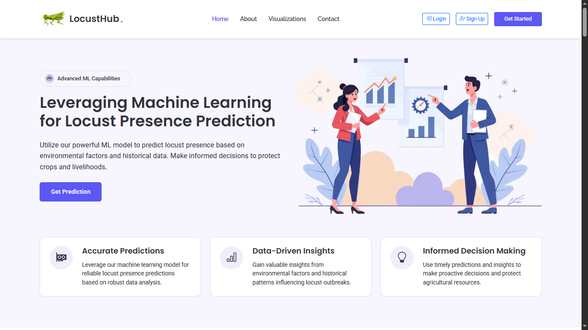
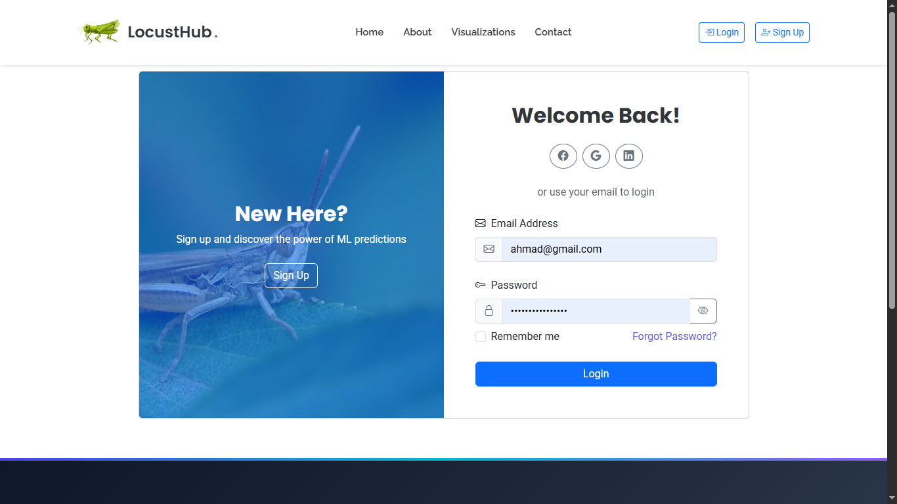
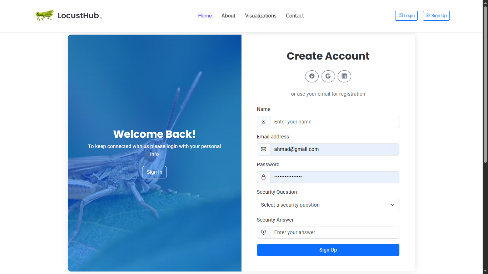
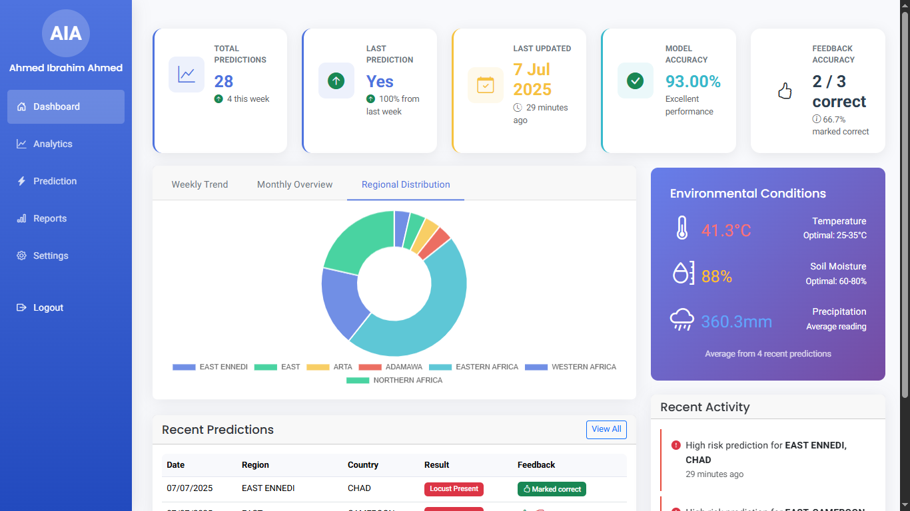
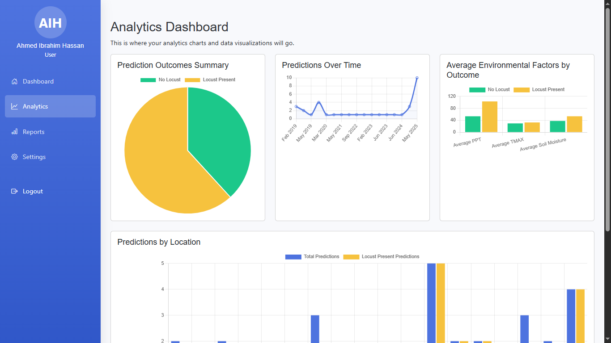
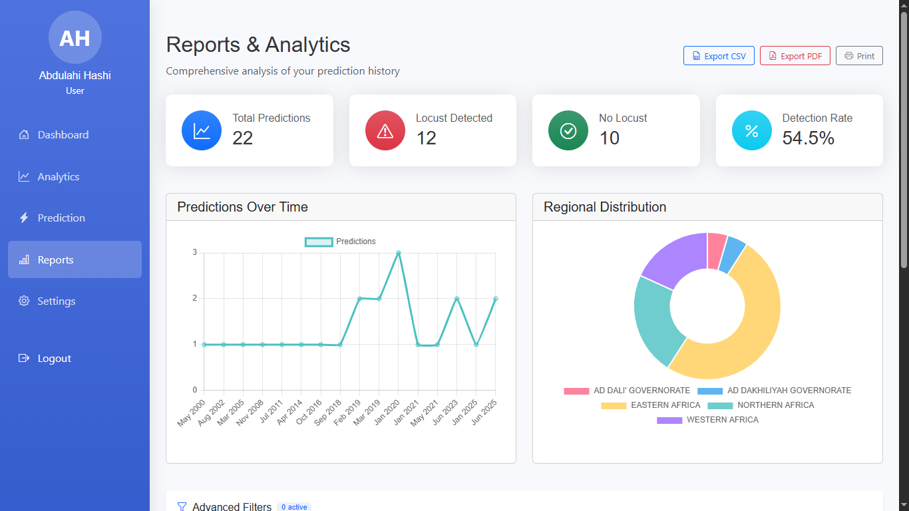
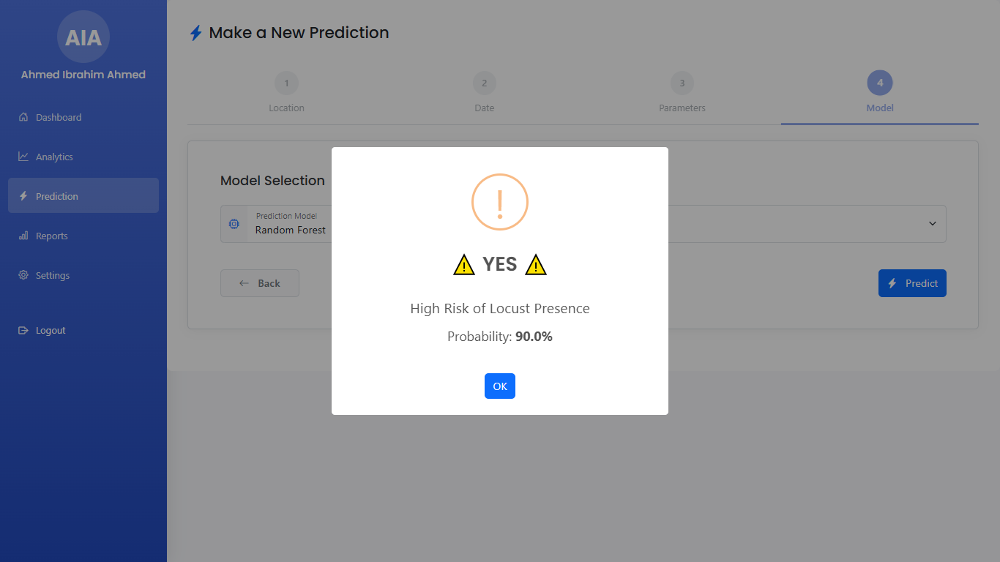
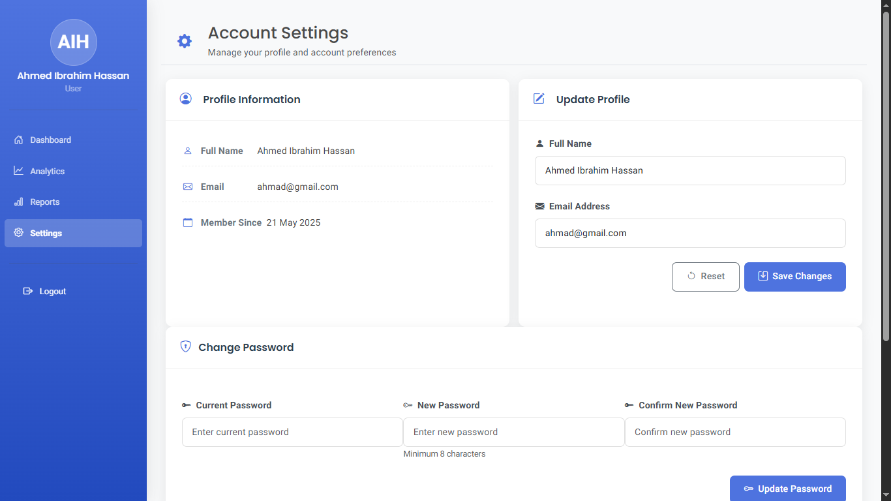

# LocustHub Platform

[](https://opensource.org/licenses/MIT)

A comprehensive Locust Prediction System developed as a final year thesis project. This platform leverages machine learning to predict locust swarms, providing early warnings and analysis tools to agricultural communities.

## 🚀 Features

- **Real-time Prediction**: Machine learning models for accurate locust swarm forecasting
- **Interactive Dashboard**: Visualize predictions and historical data
- **User Management**: Secure authentication and authorization system
- **Data Analysis**: Tools for analyzing environmental factors affecting locust behavior
- **Responsive Design**: Accessible on desktop and mobile devices

## 📸 Screenshots

<div align="center">
  <h3>Landing Page</h3>
  
  
  <div style="display: flex; flex-wrap: wrap; justify-content: center; gap: 20px; margin-top: 20px;">
    <div style="flex: 1; min-width: 300px; max-width: 48%;">
      <h4>Login</h4>
      
    </div>
    <div style="flex: 1; min-width: 300px; max-width: 48%;">
      <h4>Sign Up</h4>
      
    </div>
  </div>

  <div style="margin-top: 30px;">
    <h3>Dashboard</h3>
    
  </div>

  <div style="display: flex; flex-wrap: wrap; justify-content: center; gap: 20px; margin-top: 30px;">
    <div style="flex: 1; min-width: 300px; max-width: 48%;">
      <h4>Analytics</h4>
      
    </div>
    <div style="flex: 1; min-width: 300px; max-width: 48%;">
      <h4>Reports</h4>
      
    </div>
  </div>

  <div style="display: flex; flex-wrap: wrap; justify-content: center; gap: 20px; margin-top: 30px;">
    <div style="flex: 1; min-width: 300px; max-width: 48%;">
      <h4>Prediction Result</h4>
      
    </div>
    <div style="flex: 1; min-width: 300px; max-width: 48%;">
      <h4>Settings</h4>
      
    </div>
  </div>
</div>


## 📁 Project Structure

```
.
├── backend/                 # Backend API and services
│   ├── .env               # Environment configuration
│   ├── app.py             # Main Flask application
│   ├── check_user.py      # User verification utility
│   ├── requirements.txt   # Python dependencies
│   ├── schema.sql         # Database schema definition
│   ├── routes/            # API route definitions
│   │   └── auth.js       # Authentication routes
│   └── README.md          # Backend documentation
│
├── frontend/            # Frontend web application
│   ├── public/            # Static files and HTML pages
│   │   ├── assets/        # CSS, JS, images
│   │   ├── forms/         # Form-related files
│   │   ├── *.html         # Application pages
│   ├── server.js          # Express server setup
│   └── README.md          # Frontend documentation
│
└── thesis-project/      # Thesis documentation and research
    ├── data/             # Research datasets
    ├── models/           # ML model files
    └── README.md         # Thesis documentation
```

## 🛠️ Installation

### Prerequisites
- Python 3.8+
- Node.js 14+
- MySQL 8.0+

### Setup

1. **Clone the repository**
   ```bash
   git clone https://github.com/MasterWithAhmad/locust-hub-platform.git
   cd locust-hub-platform
   ```

2. **Set up the backend**
   ```bash
   cd backend
   python -m venv venv
   source venv/bin/activate  # On Windows: venv\Scripts\activate
   pip install -r requirements.txt
   ```

3. **Set up the frontend**
   ```bash
   cd ../frontend
   npm install
   ```

## 🚦 Running the Application

1. **Start the backend server**
   ```bash
   cd backend
   python app.py
   ```

2. **Start the frontend server**
   ```bash
   cd ../frontend
   npm start
   ```

3. Access the application at `http://localhost:3000`

## 📚 Documentation

- [Backend Documentation](/backend/README.md) - API documentation and setup guide
- [Frontend Documentation](/frontend/README.md) - Frontend development and setup
- [ML Documentation](/ml/README.md) - Research and methodology details

## 🤝 Contributing

Contributions are welcome! Please read our [contributing guidelines](CONTRIBUTING.md) to get started.

## 📄 License

This project is licensed under the MIT License - see the [LICENSE](./LICENSE) file for details.

## 📧 Contact

Ahmad - [ahmad.netdev@gmail.com](mailto:ahmad.netdev@gmail.com)

Project Link: [https://github.com/MasterWithAhmad/locust-hub-platform](https://github.com/MasterWithAhmad/locust-hub-platform)

## 🙏 Acknowledgments

### Technologies & Libraries
- [Flask](https://flask.palletsprojects.com/) - Python web framework
- [Express.js](https://expressjs.com/) - Node.js web application framework
- [Bootstrap 5](https://getbootstrap.com/) - Frontend component library
- [MySQL](https://www.mysql.com/) - Relational database management system
- [Chart.js](https://www.chartjs.org/) - Data visualization
- [Font Awesome](https://fontawesome.com/) - Icons and UI components

### Data & Research
- [FAO Locust Watch](http://www.fao.org/ag/locusts/en/info/info/faq/index.html) - For locust behavior and prediction methodologies
- [Meteorological data sources](https://www.ncdc.noaa.gov/) - Weather and climate data